<!-- Header banner -->
<p align="center">
  
</p>

<p align="center">
  <a href="https://github.com/ReihanaDevOps">
    
  </a>
</p>

<p align="center">
  
  
  
</p>

---
---

## 🧰 Tech Arsenal

<h4 align="center">☁️ Cloud & Infrastructure</h4>
<p align="center">
  
</p>

<h4 align="center">🐳 Containers & Orchestration</h4>
<p align="center">
  
</p>

<h4 align="center">⚙️ CI/CD & Automation</h4>
<p align="center">
  
</p>

<h4 align="center">📊 Observability</h4>
<p align="center">
  
</p>

<h4 align="center">🔐 Security Toolchain</h4>
<p align="center">
  
  
  
  
  
  
  
  
</p>

---
## 🛡️ `whoami`

```yaml
name: ReihanaDevOps
role: DevSecOps Engineer @ Techhive
location: Sri Lanka 🇱🇰
mission: "Bake security into every stage of the SDLC — not bolt it on at the end."
focus:
  - CI/CD pipeline hardening & policy-as-code
  - Infrastructure as Code (Terraform, Ansible) with security guardrails
  - Container & Kubernetes security
  - Cloud security posture on AWS & GCP
  - Secrets management & supply-chain security
motto: "Automate everything. Trust nothing. Verify always."
```

---

## 🔄 My Secure Delivery Pipeline

```mermaid
flowchart LR
    A[👩‍💻 Code] --> B[🔑 Secrets Scan<br/>Gitleaks]
    B --> C[🧪 SAST<br/>SonarQube / Semgrep]
    C --> D[📦 SCA<br/>Dependency Check]
    D --> E[🐳 Build Image<br/>Docker]
    E --> F[🔍 Image Scan<br/>Trivy]
    F --> G[📜 IaC Scan<br/>Checkov / tfsec]
    G --> H[☸️ Deploy<br/>Kubernetes]
    H --> I[🕷️ DAST<br/>OWASP ZAP]
    I --> J[📊 Monitor<br/>Prometheus / Grafana]
    style A fill:#1a1b27,stroke:#7aa2f7,color:#c0caf5
    style B fill:#1a1b27,stroke:#f7768e,color:#c0caf5
    style C fill:#1a1b27,stroke:#f7768e,color:#c0caf5
    style D fill:#1a1b27,stroke:#f7768e,color:#c0caf5
    style E fill:#1a1b27,stroke:#7aa2f7,color:#c0caf5
    style F fill:#1a1b27,stroke:#f7768e,color:#c0caf5
    style G fill:#1a1b27,stroke:#f7768e,color:#c0caf5
    style H fill:#1a1b27,stroke:#9ece6a,color:#c0caf5
    style I fill:#1a1b27,stroke:#f7768e,color:#c0caf5
    style J fill:#1a1b27,stroke:#bb9af7,color:#c0caf5
```




## 🗂️ Featured Repositories

<p align="center">
  <a href="https://github.com/ReihanaDevOps/AWS"></a>
  <a href="https://github.com/ReihanaDevOps/K8s"></a>
</p>
<p align="center">
  <a href="https://github.com/ReihanaDevOps/Terraform"></a>
  <a href="https://github.com/ReihanaDevOps/Docker"></a>
</p>
<p align="center">
  <a href="https://github.com/ReihanaDevOps/Google-Cloud"></a>
  <a href="https://github.com/ReihanaDevOps/Ansible"></a>
</p>

---

## 📈 GitHub Dashboard

<p align="center">
  
  
</p>

<p align="center">
  
</p>

---

## 🔐 Security Principles I Live By

| Principle | In Practice |
|---|---|
| 🧱 **Shift Left** | Security scans run on every PR, not just before release |
| 🔑 **Zero Trust** | Least-privilege IAM, short-lived credentials, no hard-coded secrets |
| 📜 **Everything as Code** | Infra, policies, and compliance checks live in Git |
| 🔍 **Continuous Verification** | Image signing, SBOMs, and runtime monitoring |
| ♻️ **Immutable Infra** | Rebuild, don't patch — reproducible from source |

---

<p align="center">
  
</p>
